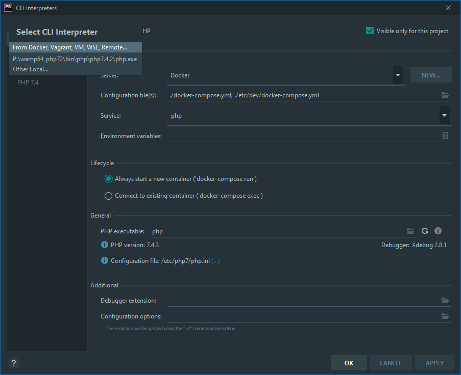
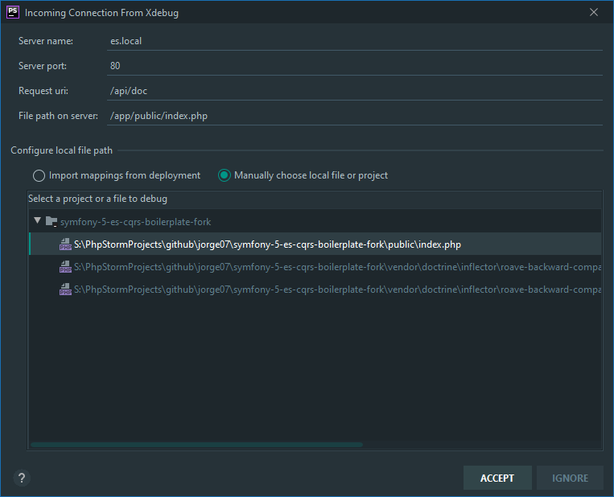

# Symfony 6 ES CQRS Boilerplate
<!-- ALL-CONTRIBUTORS-BADGE:START - Do not remove or modify this section -->

<!-- ALL-CONTRIBUTORS-BADGE:END -->

A comprehensive boilerplate demonstrating **Domain-Driven Design (DDD)**, **Command Query Responsibility Segregation (CQRS)**, and **Event Sourcing** patterns using Symfony as the framework and PHP 8.

This project showcases:
- 🏗️ **Clean Architecture** with clear separation of concerns
- 📦 **Bounded Contexts** for domain organization  
- ⚡ **Event Sourcing** for complete audit trails and temporal queries
- 🔄 **CQRS** for optimized read and write operations
- 🚌 **Message Buses** for command, query, and event handling
- 🔀 **Async Processing** with RabbitMQ for scalable event handling
- 🧪 **Comprehensive Testing** strategies for all architectural layers

> This is a long living repository that started at v4 and was upgraded to each mayor since then. You can find v4 and v5 versions at the following branches:
> 
> [symfony-5 branch](https://github.com/jorge07/symfony-6-es-cqrs-boilerplate/tree/symfony-5)
>
> [symfony-4 branch](https://github.com/jorge07/symfony-6-es-cqrs-boilerplate/tree/symfony-4)

## Documentation

### 📚 Core Concepts

**Domain-Driven Design (DDD)**
- [DDD Overview](doc/DDD/README.md) - Introduction to Domain-Driven Design concepts
- [DDD Objectives and Reasoning](doc/DDD/Objectives.md) - Why use DDD and its benefits
- [Bounded Context](doc/DDD/BoundedContext.md) - Context boundaries and integration patterns
- [Value Objects vs Entities](doc/DDD/ValueObjectsVsEntities.md) - Core building blocks explained
- [Aggregates and Aggregate Root](doc/DDD/Aggregates.md) - Consistency boundaries and business logic
- [Layered Architecture](doc/DDD/LayeredArchitecture.md) - Clean architecture with dependency inversion
- [Anti-Corruption Layer](doc/DDD/AntiCorruptionLayer.md) - Protecting domain from external systems

**CQRS and Event Sourcing**
- [CQRS Overview](doc/CQRS/README.md) - Command Query Responsibility Segregation patterns
- [CQRS Implementation](doc/CQRS/CQRSOverview.md) - Detailed CQRS explanation with examples
- [Command Bus](doc/CQRS/CommandBus.md) - Write operations and business logic execution
- [Event Sourcing](doc/CQRS/EventSourcing.md) - Storing state as sequence of events
- [Application Workflow](doc/CQRS/ApplicationWorkflow.md) - Complete request flow through the system
- [Symfony Messenger Integration](doc/CQRS/SymfonyMessenger.md) - Message bus implementation

### 🚀 Getting Started

- [Command and Query Buses](doc/GetStarted/Buses.md) - Basic bus usage
- [Creating Use Cases](doc/GetStarted/UseCases.md) - Step-by-step use case creation
- [Adding Projections](doc/GetStarted/Projections.md) - Building read models
- [Async Processing](doc/GetStarted/Async.md) - Background event processing
- [UI Workflow](doc/Workflow.md) - Complete user interaction flow

### 🔧 Advanced Topics

- [Testing Strategies](doc/Advanced/TestingStrategies.md) - Comprehensive testing approach
- [Read and Write Models](doc/Advanced/ReadWriteModels.md) - Optimizing for different use cases

### 🛠️ Development Setup

- [Xdebug Configuration](doc/GetStarted/Xdebug.md) - Debugging setup
- [Kubernetes Deployment](doc/Deployment.md) - Production deployment

## Architecture

## Implementations

- [x] Environment in Docker
- [x] Symfony Messenger
- [x] Event Store
- [x] Read Model
- [x] Async Event subscribers
- [x] Rest API
- [x] Web UI (A Terrible UX/UI)
- [x] Event Store Rest API 
- [x] Swagger API Doc

## Use Cases

#### User
- [x] Sign up
- [x] Change Email
- [x] Sign in
- [x] Logout

## Stack

- PHP 8+
- Mysql 8.0
- Elastic & Kibana 7.11.0
- RabbitMQ 3

## Project Setup

|    Action        	|     Command    |
|------------------	|---------------	|
|  Setup 	          | `make start`   |
|  Run Tests       	| `make phpunit` |
|  Static Analisys 	| `make style`  	|
|  Code Style      	| `make cs`     	|
|  Code style check	| `make cs-check`|
|  PHP Shell 	      | `make s=php sh`|
|  Xdebug 	         | `make xoff/xon`|
|  Build Artifacts   | `make artifact`|

## PHPStorm integration

PHPSTORM has native integration with Docker compose. That's nice but will stop your php container after run the test scenario. That's not nice when using fpm. A solution could be use another container just for that purpose but is way slower and I don't want. For that reason I use ssh connection.

### IMPORTANT

> **ssh in the container it's ONLY for that reason and ONLY in the DEV TAG, if you've ssh installed in your production container, you're doing it wrong...***

[Click here for the detailed instructions about how to setup the PHP remote interpreter in PHPStorm.](https://github.com/jorge07/alpine-php/blob/master/doc/IDE.md)

If you're already familiar with it, here a quick configuration reference:

|    Host          	|    Direction  |
|------------------	|--------------	|
|  Docker 4 mac 	   | `localhost`   |
|  Dinghy       	   | `$ dinghy ip` |

**Port:** `2323`

**Filesystem mapping:** `{PROJECT_PATH}` -> `/app`

### Xdebug

To ease your development process, you can use Xdebug with PHPSTORM.

1. Add a Docker interpreter

   

2. Enable Xdebug listenning. Don't forget to also activate Xdebug helper from your browser.
   
   
   
   Additionally, you can check `Break at first line in PHP scripts` to ensure your debug is working.

3. Make a request from you API at http://127.0.0.1/api/doc for example. You should see this popup:

   
   
   Click on `Accept` and you should be ready to debug ! Start placing breakpoints on your code and enjoy debugging !

> Note for Windows users:
>
> You might need to update `docker-os=` to `docker-os=windows` in [Makefile](makefile)
> or specify its value on command line like `$ make start docker-os=windows`.

## Contributors ✨

Thanks goes to these wonderful people ([emoji key](https://allcontributors.org/docs/en/emoji-key)):

<!-- ALL-CONTRIBUTORS-LIST:START - Do not remove or modify this section -->
<!-- prettier-ignore-start -->
<!-- markdownlint-disable -->
<table>
  <tr>
    <td align="center"><a href="http://tacon.eu"> <b>Luis</b></a> <a href="https://github.com/jorge07/symfony-6-es-cqrs-boilerplate/commits?author=Lutacon" title="Code">💻</a></td>
    <td align="center"><a href="https://github.com/cv65kr"> <b>Kajetan</b></a> <a href="https://github.com/jorge07/symfony-6-es-cqrs-boilerplate/commits?author=cv65kr" title="Code">💻</a></td>
    <td align="center"><a href="https://coderslab.pl"> <b>Krzysztof Kowalski</b></a> <a href="https://github.com/jorge07/symfony-6-es-cqrs-boilerplate/commits?author=kowalk" title="Code">💻</a></td>
    <td align="center"><a href="http://patryk.it"> <b>Patryk Woziński</b></a> <a href="https://github.com/jorge07/symfony-6-es-cqrs-boilerplate/commits?author=patrykwozinski" title="Code">💻</a></td>
    <td align="center"><a href="https://github.com/jon-ht"> <b>jon-ht</b></a> <a href="https://github.com/jorge07/symfony-6-es-cqrs-boilerplate/commits?author=jon-ht" title="Code">💻</a></td>
  </tr>
</table>

<!-- markdownlint-enable -->
<!-- prettier-ignore-end -->
<!-- ALL-CONTRIBUTORS-LIST:END -->

This project follows the [all-contributors](https://github.com/all-contributors/all-contributors) specification. Contributions of any kind welcome!
